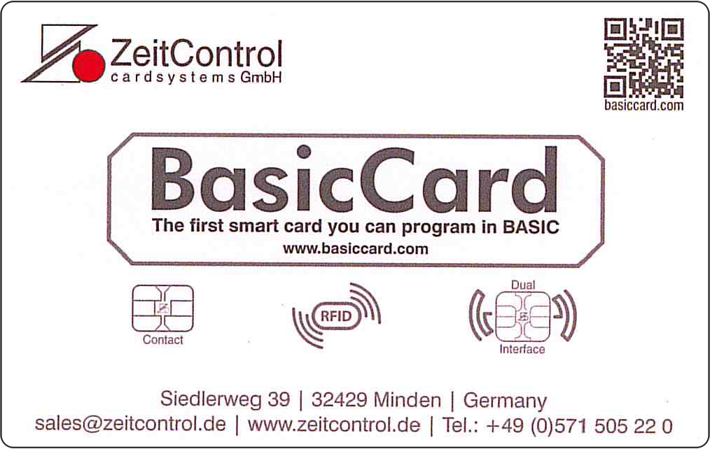

# Welcome stranger!
This is the repository for Berlin Sides 2017 "Smartcard Island".<br>
A  project from adesso AG and ZeitControl cardsystems GmbH.<br>
For further informations about these companies click on one of the specific images below.<br>
<div>
<a href="https://adesso.de"></a>
<a href="https://secure.zeitcontrol.de/shop"></a>
</div>

# Technical details

The smartcard given to you is a BasicCard ZC7.6 with an NXP P5CD081 from the SmartMX family inside.

### Standard family features

- EEPROM: choice of 16 KB, 20 KB, 40 KB or 80 KB
  - Data retention time: 25 years minimum
  - Endurance: 500000 cycles typical
- ROM: 264 KB
- RAM: 7680 B
  - 256 B IRAM + 4.75 KB standard RAM usable for CPU
  - 2560 B FXRAM usable for FameXE
- Dedicated, Accelerated Secure_MX51 smart card CPU (Memory eXtended/enhanced 80C51) 
  - 5-metal layer 0.14 μm CMOS technology
  - Operating in Contact and Contactless mode (dependent on family type option)
  - Featuring a 24-bit universal memory space, 24-bit program counter
  - Combined universal program and data linear address range up to 16 MB
  - Additional instructions to improve:
    - pointer operations
    - performance
    - code density of both C and Java source code
- ISO/IEC 7816 contact interface
- ISO/IEC 14443 contactless interface
- PKI coprocessor FameXE
- Support of major Public Key Cryptography (PKC) systems such as RSA, Elgamel, DSS, Diffie-Hellman, Guillou-Quisquater, Fiat-Shamir and Elliptic Curves
  - 8192 bits maximum key length for RSA with randomly chosen modulus
  - 4096 bits maximum key length for calculation within RAM
  - 32-bit interface
  - Boolean operations for acceleration of standard, symmetric cipher algorithms
- High speed triple-DES coprocessor (64-bit parallel processing DES engine)
  - Two or three keys loadable
  - DES3 performance < 40 μs
- High speed AES coprocessor (128-bit parallel processing AES engine)
- Memory Management Unit (MMU) with increased number of 8 cache segments
- Low power and low voltage design using NXP Semiconductors’ handshaking technology
- Multiple source vectorized interrupt system with four priority levels
- Watch exception provides software debugging facility
- Multiple source RESET system
- Two 16-bit timers
- Highly reliable EEPROM for both data storage and program execution
- Bytewise EEPROM programming and read access
- Versatile EEPROM programming of 1 B to 64 B at a time or, optionally 1 B to 128 B at a time
- Typical EEPROM page erasing time: 1.7 ms
- Typical EEPROM page programming time: 1.0 ms
- Power-saving Idle mode
- Wake-up from Idle mode by RESET or any activated interrupt
- Contact configuration and serial interface in accordance with ISO/IEC 7816
- Power-saving Sleep (power-down) mode or Clockstop mode
- ISO/IEC 7816 UART supporting standard protocols T=0 and T=1 as well as high speed personalization up to 1 Mbit/s
- External or internally generated configurable CPU clock
- 1 MHz to 10 MHz operating external clock frequency range
  - Internal CPU clock up to 30 MHz with synchronous operation
  - Internal clocking independent of externally applied frequency
- High speed 16-bit CRC engine in accordance with ITU-T polynomial definition
- Low power Random Number Generator (RNG) in hardware, AIS-31 compliant
- 1.62 V to 5.5 V extended operating voltage range for class C, B and A
- Optional extended Class B operation mode (2.2 V to 5.5 V targeted for battery supplied applications)
- −25 °C to +85 °C ambient temperature
- Broad spectrum of delivery types:
  - Wafers
  - Modules
  - Packages
  - Inlays

### P5CD081 specific features

- CIU fully compatible with ISO/IEC 14443A:
  - 13.56 MHz operating frequency
  - fully supports the T=CL protocol in accordance with ISO/IEC 14443-4
  - factory configurable for higher input capacitance to match smaller loop antennas
  - supported data transfer rates: 106 kbit/s, 212 kbit/s, 424 kbit/s and 848 kbit/s
  - MIFARE reader infrastructure compatibility via optional MIFARE 1 K or 4 K emulation including built-in anticollision support
- Two additional I/O ports: IO2 and IO3 for full-duplex serial data communication


## Applications & Use cases

- Trusted Mobile Wallet (TMW)
- FIDO-U2F-Token
- NFC-Tag

## Useful tools

**NFC TagInfo from NXP Semiconductors for diagnostics**<br>
[https://play.google.com/store/apps/details?id=com.nxp.taginfolite](https://play.google.com/store/apps/details?id=com.nxp.taginfolite)<br>

**NFC Tools from wakdev to manage NDEF tag content**<br>
[https://play.google.com/store/apps/details?id=com.wakdev.wdnfc](https://play.google.com/store/apps/details?id=com.wakdev.wdnfc)<br>

**Google Authenticator from Google for FIDO U2F NFC support**<br>
[https://play.google.com/store/apps/details?id=com.google.android.apps.authenticator2](https://play.google.com/store/apps/details?id=com.google.android.apps.authenticator2)<br>

**FIDO U2F demo at Google appspot**<br>
[https://u2fdemo.appspot.com/](https://u2fdemo.appspot.com/)<br>

**AusweisApp2 from Governikus for eID functionality**<br>
[https://play.google.com/store/apps/details?id=com.governikus.ausweisapp2](https://play.google.com/store/apps/details?id=com.governikus.ausweisapp2)<br>

**Governikus Autent Test-PKI application for eID-Test**<br>
[https://test.governikus-eid.de/Autent-DemoApplication/](https://test.governikus-eid.de/Autent-DemoApplication/)<br>
<br><br><br><br><br><br><br>

/*
## Welcome to GitHub Pages

You can use the [editor on GitHub](https://github.com/VX4/bs17/edit/master/README.md) to maintain and preview the content for your website in Markdown files.

Whenever you commit to this repository, GitHub Pages will run [Jekyll](https://jekyllrb.com/) to rebuild the pages in your site, from the content in your Markdown files.

### Markdown

Markdown is a lightweight and easy-to-use syntax for styling your writing. It includes conventions for

```markdown
Syntax highlighted code block

# Header 1
## Header 2
### Header 3

- Bulleted
- List

1. Numbered
2. List

**Bold** and _Italic_ and `Code` text

[Link](url) and 
```

For more details see [GitHub Flavored Markdown](https://guides.github.com/features/mastering-markdown/).

### Jekyll Themes

Your Pages site will use the layout and styles from the Jekyll theme you have selected in your [repository settings](https://github.com/VX4/bs17/settings). The name of this theme is saved in the Jekyll `_config.yml` configuration file.

### Support or Contact

Having trouble with Pages? Check out our [documentation](https://help.github.com/categories/github-pages-basics/) or [contact support](https://github.com/contact) and we’ll help you sort it out.
*/
