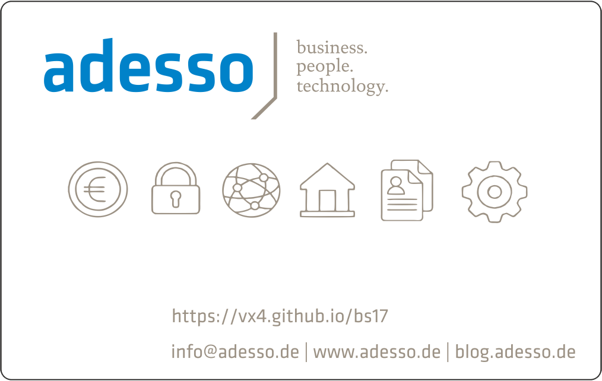

# Welcome stranger!
This is the repository for Berlin Sides 2017 "Smartcard Island". 
A project from adesso AG and ZeitControl cardsystems GmbH. 
For further informations about these companies click on one of the specific images below. 

# The Card Applications
  - German eID, Trusted Mobile Wallet (TMW) implementation
    - Test-PKI keys (CSCA and DVCA trust anchor)
    - any terminal certificate allowed (verification switched off for testing)
    - transport PIN is "00000" and has to be changed to a 6-digit PIN before use

  - FIDO U2F
    - unique hardware random generated master key, not known outside card
    - works with Google Authententicator
    - "unlimited keys", "database-less" key-derivation scheme
    
  - NDEF Typ 4 tag
    - 2kBytes in total size
    - open for read/write, pre-personalized to point your phone to this site
  
  - others in non-provisioned and/or experimental state
    - OATH, PIV, SSCD, BTC, HSM
    
  - the card issues a double-size non-random UID for use with simple NFC-locks, please keep
    in mind such locks are horribly unsafe
  
Some readers (such as SCL011) are known NOT TO WORK reliably.

# The Card
  - BasicCard 7.6 revision D, ~72kBytes free EEPROM
  - Basic language dialect used instead of JavaCard, .NET (C#), or MULTOS (MEL / C)
  - developers have to learn additional language(s) (dialects) for resource constrained environments
  - programming MULTOS is not a pleasure, Javacard has a varying support of primitives and .NET card is (almost?) dead
  - Basic dialect quite simple, easy to learn and understand, offers efficient expressions
  - different variants exists as multi application and as "single application" card, 7.x is a single application variant
  - VM implemented as stack machine, much more efficient than JavaCard esp. for array / string operations and access to
    far more useful cryptographic primitives (point addition, simple scalar multiplication, lots of built-in curves,
    big number operations, SHA512, etc.)
  - [Developer Documentation](./BasicCrd.pdf)
  - [Overview Datasheet](./ProMultiDataSheet.pdf)

## Useful tools

**NFC TagInfo from NXP Semiconductors for diagnostics** 
[https://play.google.com/store/apps/details?id=com.nxp.taginfolite](https://play.google.com/store/apps/details?id=com.nxp.taginfolite) 

**NFC Tools from wakdev to manage NDEF tag content** 
[https://play.google.com/store/apps/details?id=com.wakdev.wdnfc](https://play.google.com/store/apps/details?id=com.wakdev.wdnfc) 

**Google Authenticator from Google for FIDO U2F NFC support** 
[https://play.google.com/store/apps/details?id=com.google.android.apps.authenticator2](https://play.google.com/store/apps/details?id=com.google.android.apps.authenticator2) 

**FIDO U2F demo at Google appspot** 
[https://u2fdemo.appspot.com/](https://u2fdemo.appspot.com/) 

**AusweisApp2 from Governikus for eID functionality** 
[https://play.google.com/store/apps/details?id=com.governikus.ausweisapp2](https://play.google.com/store/apps/details?id=com.governikus.ausweisapp2) 

**Governikus Autent Test-PKI application for eID-Test** 
[https://test.governikus-eid.de/Autent-DemoApplication/](https://test.governikus-eid.de/Autent-DemoApplication/) 

# Technical chip details

The smartcard is a BasicCard 7.6D contactless-only on NXP P5CD081 (SmartMX).

### Standard SmartMX family features

- EEPROM: choice of 16 KB, 20 KB, 40 KB or 80 KB
  - Data retention time: 25 years minimum
  - Endurance: 500000 cycles typical
- ROM: 264 KB
- RAM: 7680 B
  - 256 B IRAM + 4.75 KB standard RAM usable for CPU
  - 2560 B FXRAM usable for FameXE
- Dedicated, Accelerated Secure_MX51 smart card CPU (Memory eXtended/enhanced 80C51) 
  - 5-metal layer 0.14 μm CMOS technology
  - Operating in Contact and Contactless mode (dependent on family type option)
  - Featuring a 24-bit universal memory space, 24-bit program counter
  - Combined universal program and data linear address range up to 16 MB
  - Additional instructions to improve:
    - pointer operations
    - performance
    - code density of both C and Java source code
- ISO/IEC 7816 contact interface
- ISO/IEC 14443 contactless interface
- PKI coprocessor FameXE
- Support of major Public Key Cryptography (PKC) systems such as RSA, Elgamel, DSS, Diffie-Hellman, Guillou-Quisquater, Fiat-Shamir and Elliptic Curves
  - 8192 bits maximum key length for RSA with randomly chosen modulus
  - 4096 bits maximum key length for calculation within RAM
  - 32-bit interface
  - Boolean operations for acceleration of standard, symmetric cipher algorithms
- High speed triple-DES coprocessor (64-bit parallel processing DES engine)
  - Two or three keys loadable
  - DES3 performance < 40 μs
- High speed AES coprocessor (128-bit parallel processing AES engine)
- ISO/IEC 7816 UART supporting standard protocols T=0 and T=1 as well as high speed personalization up to 1 Mbit/s
- Low power Random Number Generator (RNG) in hardware, AIS-31 compliant
- 1.62 V to 5.5 V extended operating voltage range for class C, B and A
- Optional extended Class B operation mode (2.2 V to 5.5 V targeted for battery supplied applications)
- −25 °C to +85 °C ambient temperature

### P5CD081 specific features

- CIU fully compatible with ISO/IEC 14443A:
  - 13.56 MHz operating frequency
  - supported data transfer rates: 106 kbit/s, 212 kbit/s, 424 kbit/s and 848 kbit/s
  - MIFARE reader infrastructure compatibility via optional MIFARE 1 K or 4 K emulation including built-in anticollision support

